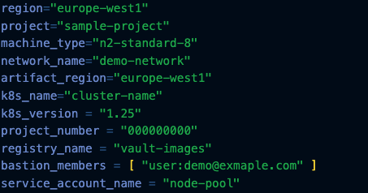

# Thought Machine - Google Cloud Terraform Template for Vault

Opinated way for deploying landing zone required for Thought Machine Vault using Terraform. This will created the following resources;

- Stores tfstate file in Cloud Storage Bucket
- VPC Network including Peering for AlloyDB
- Kubernetes Cluster incl. spot and on-demand node pools
- Artifact Repository
- Service Account for Kubernetes Nodes
- AlloyDB Database
- Bastion Host for connecting to Kubernetes Cluster

## Usage

Before running the scripts you will need to have already configured two resources;

- Project
- Cloud Storage Bucket

These will be used to stand up the infrastructure and then deploy the resources to the environment. Once configured you will then need to create your `terraform.tfvars` file.

There is a sample provided in the repo `terraform.tfvars.sample` these are the required variables to be created.

If you have not initialised terraform before starting, run `terraform init`

To view the resources that will be created, run `terraform plan -o vault-gcp.tfplan` at this point you can validate the resources being created for your environment.

After verifying the resources run `terraform apply vault-gcp.tfplan` - this will take around 30 minutes to complete, and at this point the next step would be installing Vault.

[Installaing Vault](https://docs.thoughtmachine.net/vault-core/5-0/EN/environment_and_installation/infrastructure_docs/infrastructure_and_installation_guides/getting_started_with_vault_core/#full_release_document_list-vault_release_notes)

## Terraform Graph

For visualing what is deployed and the dependencies between the services and variables required, we have generated the terraform graph. To do this you can run;

`terraform graph`

To convert this to an image that is more easily consumable you can use the following command;

`terraform graph -type=plan | dot -Tpng -o graph.png`

## Cleanup

As the infrastructure is managed by Terraform the quickest way to delete the resources created is using `terraform destroy` this allows you to use the project to validate setup in the future or alternatively you can delete the Google Cloud project and resources will be automatically destroyed.
